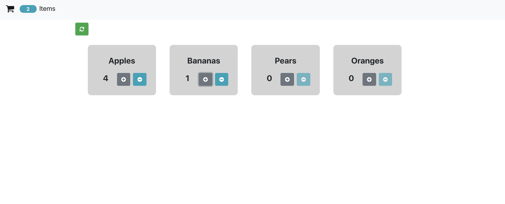

# React Practice Interview Question

## MVP

### AC (Acceptance Criteria)
- Displays list of items with the current amount.
- When a user presses the plus and minus buttons, the item is incremented or decremented.
- At the top of the screen, display the number of unique items currently in the user's cart. 
- Clicking the reset button sets all the items to zero. 
- Match the styles of the wireframe.
- Ensure best coding practices.

## Scripts

Install node modules

#### `npm install`

In the project directory, you can run:

#### `npm start`

Runs the app in the development mode. 
Open [http://localhost:3000](http://localhost:3000) to view it in the browser.
